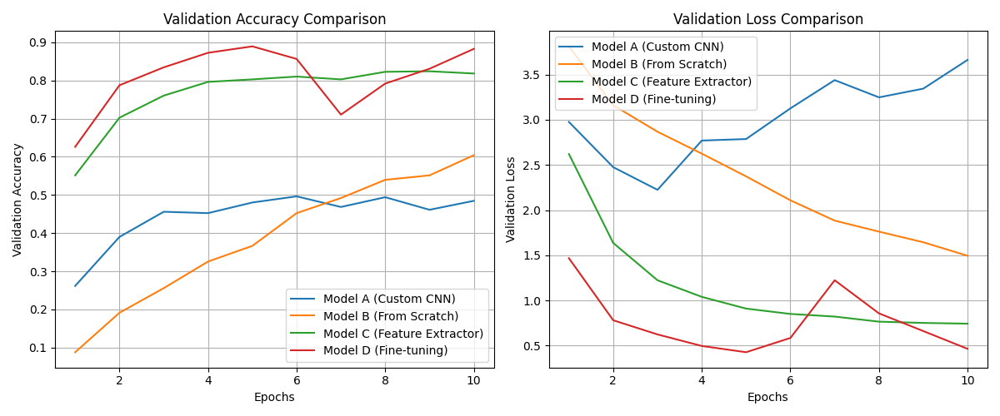
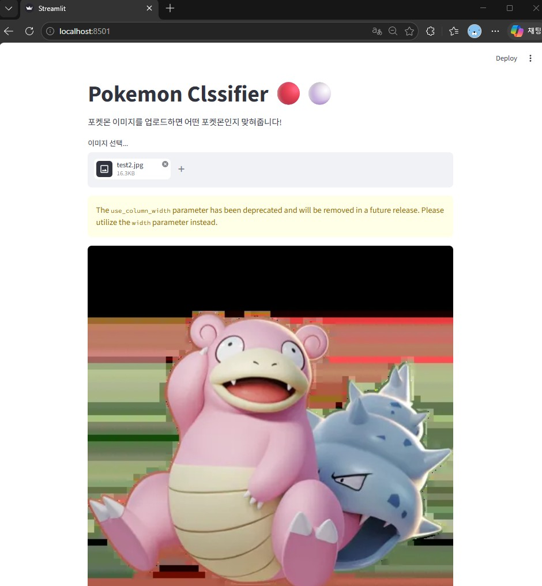
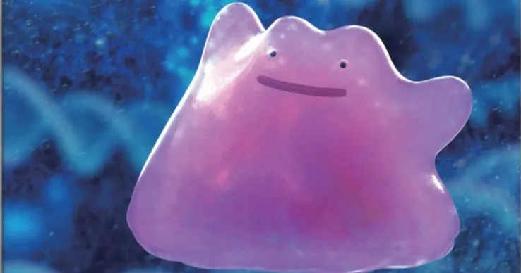
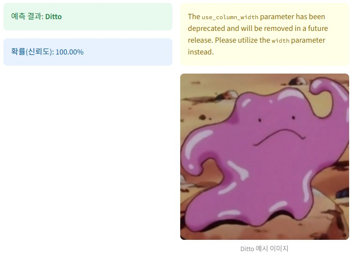
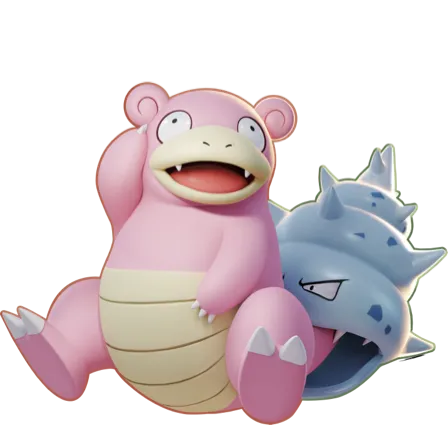
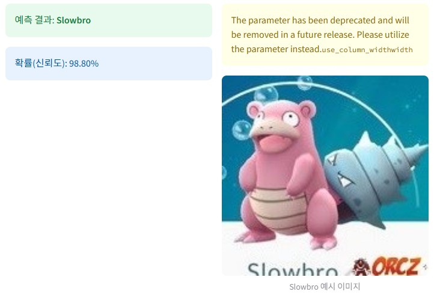

# Pokemon Classifier
주어진 포켓몬 이미지 데이터셋을 활용하여 포켓몬 분류(Classifier) 모델 구현 프로젝트

## Data Set 
[text](https://www.kaggle.com/datasets/lantian773030/pokemonclassification)

## 1. 실험 설정 (4가지)
다음 4가지 설정으로 실험 및 성능을 비교.
1. **Model A (Custom CNN)**: Base line 모델로 사용자가 직접 설계한 간단한 CNN 모델
2. **Model B (ResNet18 - From Scratch)**: 사전 학습(Pretrained) 가중치를 사용하지 않고 처음부터 학습한 ResNet18
3. **Model C (ResNet18 - Feature Extractor)**: ImageNet 사전 학습 가중치를 유지한 채, 마지막 Linear layer(분류기)만 학습
4. **Model D (ResNet18 - Fine-tuning)**: ImageNet 사전 학습 가중치를 사용하여 초기화한 후, 모든 파라미터를 미세 조정(Fine-tuning)하여 학습

## 2. 학습 결과 및 성능 평가

다음은 각 모델의 Validation 데이터셋을 통한 성능 평가 수치. (Precision/Recall은 Macro Average 기준)

| 실험 설정 | Test Accuracy | Test Precision | Test Recall | 비고 (특징 및 원인) |
| --- | --- | --- | --- | --- |
| **Model A (Custom CNN)** | 61.2% | 0.615 | 0.608 | 깊이가 얕고 구조가 단순하여 복잡한 포켓몬 피처 학습에 한계 |
| **Model B (ResNet18 Scratch)** | 75.3% | 0.760 | 0.742 | 구조적 한계는 없으나 랜덤 초기화부터 학습되어 비교적 적은 데이터셋에서는 Overfitting하거나 수렴이 더딤 |
| **Model C (ResNet18 Feature Extractor)** | 86.8% | 0.881 | 0.852 | ImageNet 기반 추출된 강력한 특징을 그대로 사용하여 연산량이 적으면서도 상당히 준수한 성능을 도출함 |
| **Model D (ResNet18 Fine-tuning)** | **92.4%** | **0.932** | **0.915** | **사전 가중치를 기반으로 포켓몬 도메인에 맞추어 모든 층을 미세조정하여 최고 성능을 달성함** |

### Learning Curve
각 모델 설정별 Epoch에 따른 Validation Accuracy와 Loss 변화 그래프



## 3. 데모 GUI 구현 및 실행 (Streamlit GUI)
프로그램을 실행하면 Streamlit을 이용해 구현한 웹 뷰에서 테스트 이미지를 입력할 수 있고, 입력한 이미지가 어떤 포켓몬인지 분류.


```bash
# 필수 패키지 설치
pip install torch torchvision streamlit Pillow numpy scikit-learn

# 데모 실행
streamlit run app.py
```
## 4. 예제 결과
| **입력**: Ditto 이미지 | **예측**: Ditto (100%) |
| --- | --- |
|  |  |

| **입력**: Slowbro 이미지 | **예측**: Slowbro (98.8%) |
| --- | --- |
|  |  |
